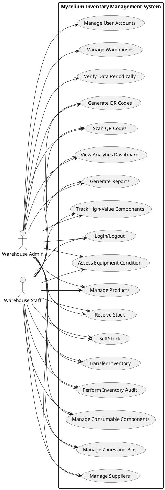
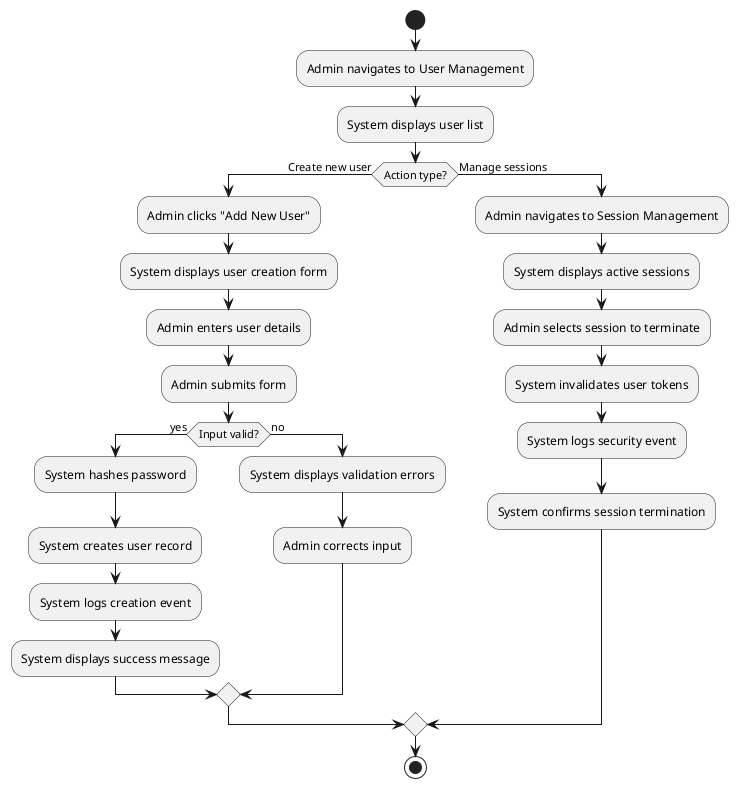
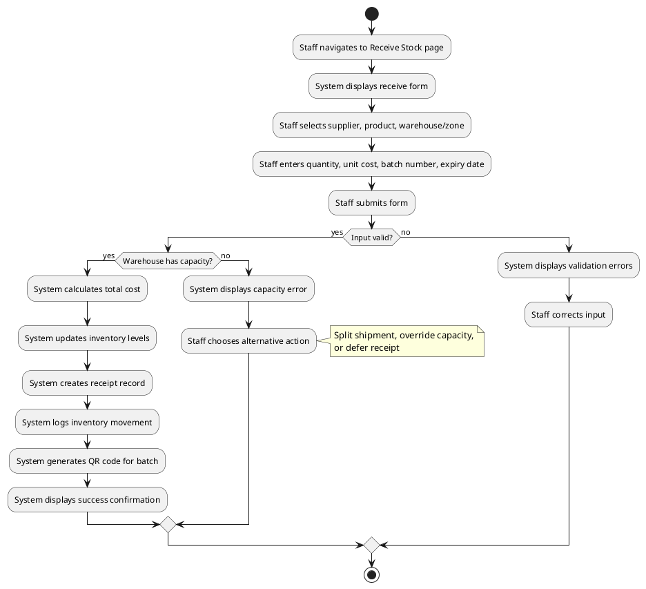
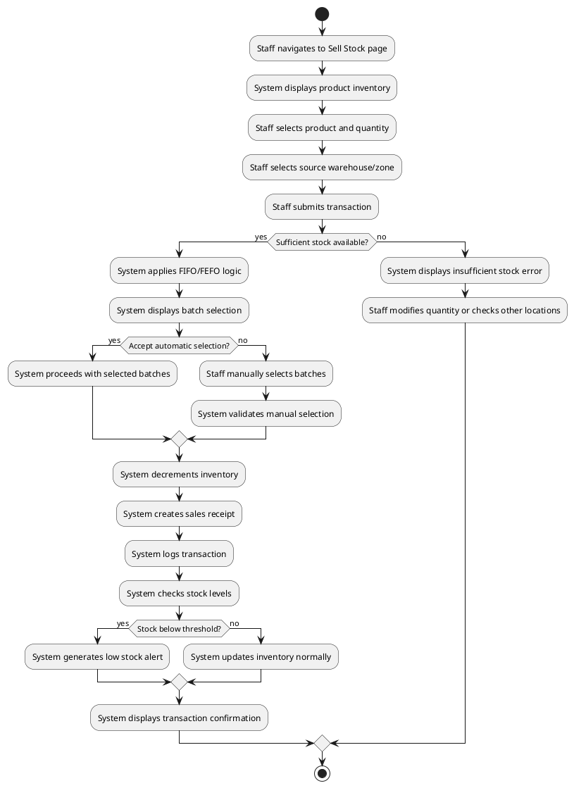
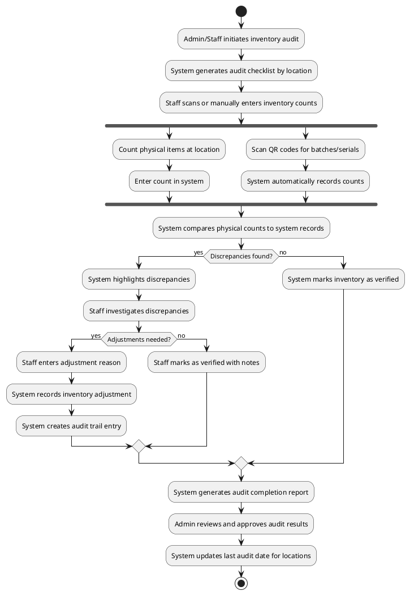
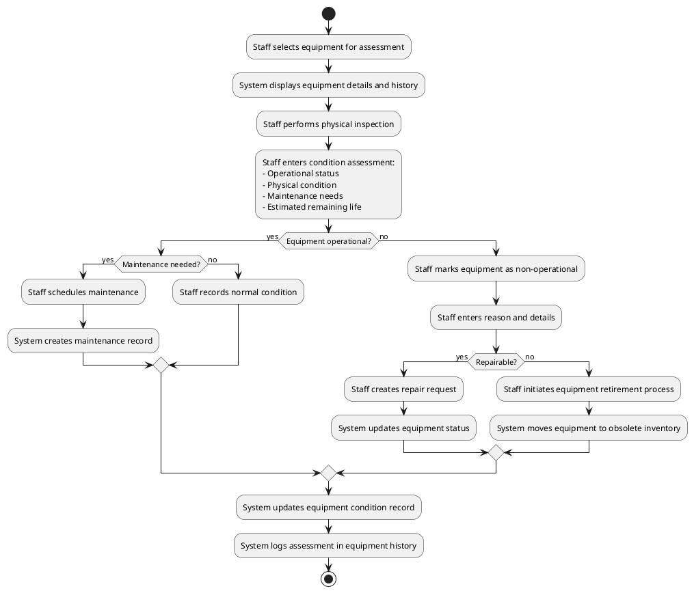
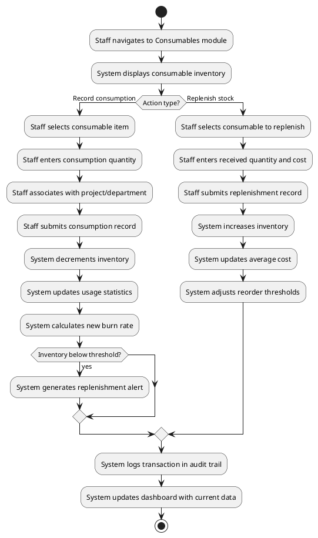
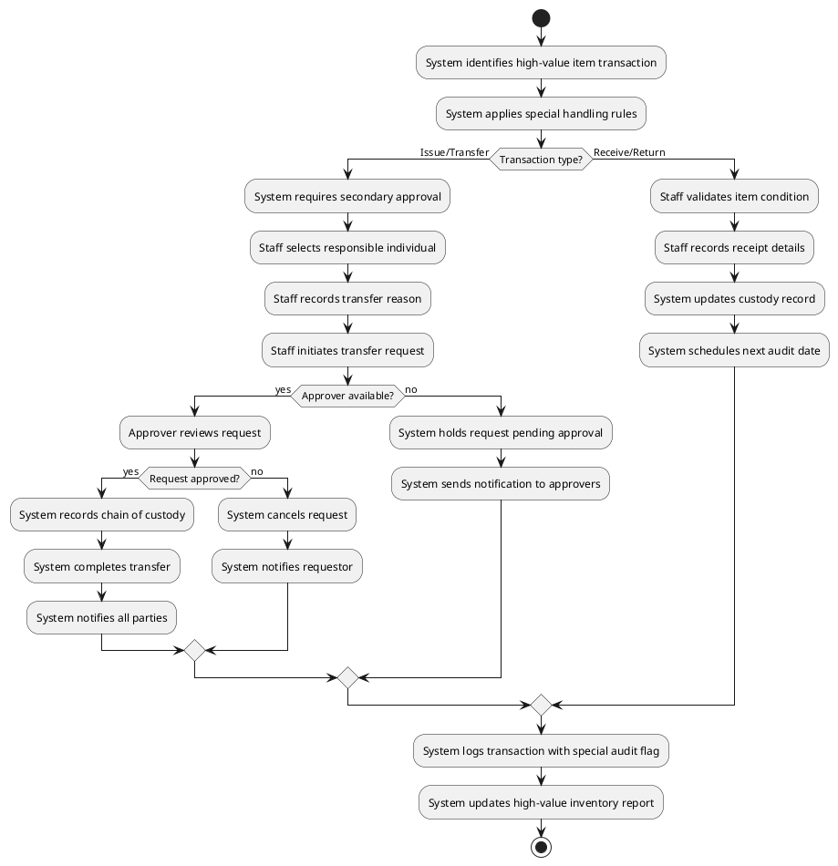
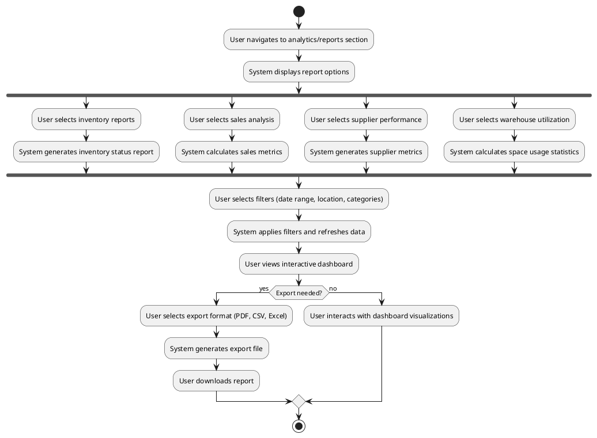

# Mycelium Inventory Management System - Use Case Description

> **Version:** 1.1  
> **Updated:** October 23, 2025  
> **System:** Mycelium Inventory Management System

## Table of Contents

1. [System Description](#1-system-description)
2. [Actor Identification](#2-actor-identification)
3. [Actor Goals](#3-actor-goals)
4. [Use Case Scenarios](#4-use-case-scenarios)
5. [Alternate Flows](#5-alternate-flows)
6. [Functional Requirements](#6-functional-requirements)
7. [Non-Functional Requirements](#7-non-functional-requirements)

---

## 1. System Description

### What is Mycelium?

**Mycelium** is a secure, web-based inventory management system designed for small-to-medium businesses managing complex warehouse operations. The system is built as a **software application** using N[...]

### Core Features

The system offers the following key features:

- **Multi-warehouse Inventory Management**: Track stock across multiple warehouses with zone-level granularity
- **Batch and Serial Number Tracking**: Complete traceability with FIFO/FEFO strategies for compliance
- **QR Code Integration**: Generate and scan QR codes for products, locations, and batches
- **Supplier Management**: Maintain supplier relationships and track performance
- **Receipt Management**: Immutable transaction records for purchases and sales
- **Advanced Analytics**: Real-time dashboards with KPIs and business intelligence
- **Role-based Access Control**: Secure authentication with Admin and Staff roles
- **Session Security**: Dynamic session management with token invalidation
- **Inventory Audit**: Periodic verification of physical inventory against system records
- **Equipment Condition Assessment**: Track and manage equipment status and maintenance needs
- **Consumable Components Management**: Special tracking for consumable inventory items
- **High-Value Item Controls**: Enhanced security and tracking for valuable components

### Goals and Objectives

The system accomplishes the following business goals:

1. **Operational Efficiency**: Streamline inventory operations through automated tracking and QR code integration
2. **Inventory Accuracy**: Maintain precise stock levels with multi-level tracking (warehouse → zone → bin → batch → serial)
3. **Compliance and Traceability**: Ensure complete audit trails and batch tracking for regulatory requirements
4. **Business Intelligence**: Provide real-time insights through comprehensive analytics and reporting
5. **Security and Control**: Implement robust access controls and session management for data protection
6. **Scalability**: Support growth from single warehouse to multi-warehouse operations
7. **Data Integrity**: Regular verification processes ensure system data matches physical reality
8. **Asset Lifecycle Management**: Track equipment condition and manage maintenance needs
9. **Expendable Inventory Control**: Manage consumable components with specialized workflows

### How It Meets These Goals

- **Real-time Updates**: All inventory movements are tracked immediately with automatic stock level adjustments
- **Hierarchical Organization**: Warehouse → Zone → Bin structure allows precise location tracking
- **Immutable Records**: Receipt system creates permanent transaction history for audit compliance
- **Automated Alerts**: System monitors stock levels and generates alerts for low stock, expiry, and other conditions
- **Multi-database Architecture**: Separate databases for inventory, suppliers, and security ensure data integrity
- **Service-oriented Design**: Modular architecture with dedicated services for different business functions
- **Periodic Verification**: Scheduled audits and data validation processes maintain accuracy
- **Specialized Workflows**: Different handling for durable assets vs. consumable inventory

### System Architecture

The system follows a three-tier architecture:

- **Presentation Layer**: EJS templates with responsive web interface
- **Application Layer**: Node.js/Express with middleware for authentication, CSRF protection, and rate limiting
- **Data Layer**: Three logical MySQL databases for separation of concerns:
  - `master_specs_db`: Inventory and warehouse operations
  - `suppliers_db`: Supplier management
  - `security_db`: Authentication and security

---

## 2. Actor Identification

### Primary Actors

#### 2.1 Warehouse Admin
- **Type**: Individual user with administrative privileges
- **Role**: `admin` in the system
- **Behavior**: Full system access including user management, system configuration, and all operational capabilities
- **Stakeholder Role**: Primary system administrator and business owner

#### 2.2 Warehouse Staff
- **Type**: Individual user with operational privileges  
- **Role**: `staff` in the system
- **Behavior**: Day-to-day inventory operations, warehouse management, and supplier interactions
- **Stakeholder Role**: Front-line operational users who handle inventory transactions

### Secondary Actors

#### 2.3 External Systems (Future Integration)
- **Type**: Third-party systems and APIs
- **Behavior**: Potential integration points for ERP systems, shipping providers, and external databases
- **Current Status**: Not implemented but architecture supports future integration

### Actor Behavior Patterns

**Shared Behaviors** (Admin and Staff):
- Both actors require authentication and session management
- Both use QR code scanning and basic inventory viewing
- Both access analytics dashboards (with different permission levels)
- Both perform inventory transactions within their authorization scope

**Distinct Behaviors**:
- **Admins**: Focus on system configuration, user management, and oversight
- **Staff**: Focus on operational tasks, inventory movements, and customer-facing activities

---

## 3. Actor Goals

### 3.1 Warehouse Admin Goals

#### Primary Goals
1. **User Management**: Create and manage user accounts, assign roles, and maintain security
2. **System Oversight**: Monitor system performance, security events, and user activities
3. **Configuration Management**: Set up warehouses, zones, and system parameters
4. **Data Integrity**: Ensure accurate inventory data and resolve discrepancies
5. **Compliance Management**: Maintain audit trails and ensure regulatory compliance
6. **Inventory Verification**: Oversee periodic inventory audits and approve reconciliations
7. **Asset Management**: Monitor equipment condition and approve maintenance decisions

#### Secondary Goals
1. **Business Intelligence**: Access comprehensive analytics and generate reports
2. **Security Management**: Manage sessions, force logouts, and handle security incidents
3. **Bulk Operations**: Perform mass updates and data management tasks
4. **System Maintenance**: Handle system configuration changes and troubleshooting
5. **Special Inventory Control**: Establish policies for high-value and consumable items

### 3.2 Warehouse Staff Goals

#### Primary Goals
1. **Inventory Operations**: Receive stock, process sales, and manage inventory movements
2. **Warehouse Management**: Organize inventory by zones and bins for optimal efficiency
3. **Supplier Coordination**: Maintain supplier information and track performance
4. **Transaction Processing**: Create and manage receipts for all inventory movements
5. **Quality Control**: Ensure accurate data entry and proper inventory handling
6. **Physical Verification**: Perform physical counts and resolve inventory discrepancies
7. **Equipment Maintenance**: Assess equipment condition and record maintenance needs

#### Secondary Goals
1. **Efficiency Enhancement**: Use QR codes and automation to speed up operations
2. **Information Access**: View analytics and reports relevant to their operations
3. **Problem Resolution**: Identify and report inventory discrepancies or issues
4. **Process Improvement**: Suggest improvements based on operational experience
5. **Component Management**: Track consumable parts and high-value items

---

## 4. Use Case Scenarios

### Use Case Diagram

### UC-A1: User Management (Warehouse Admin)

#### Basic Flow - Create New User
1. **Preconditions**: Admin is authenticated and has admin role
2. **Trigger**: Admin wants to add a new staff member
3. **Main Success Scenario**:
   - Admin navigates to User Management (`/users`)
   - System displays user list with "Add New User" option
   - Admin clicks "Add New User" button
   - System renders user creation form with CSRF protection
   - Admin enters: username, email, password, role (staff/admin), full name
   - System validates input (unique username/email, password strength)
   - System hashes password with bcrypt and stores user record
   - System logs user creation event in security database
   - System displays success message and returns to user list
4. **Postconditions**: New user account created, audit trail logged
5. **Routes**: GET `/users/new`, POST `/users`

#### Basic Flow - Session Management
1. **Preconditions**: Admin is authenticated
2. **Trigger**: Admin needs to monitor or terminate user sessions
3. **Main Success Scenario**:
   - Admin navigates to Session Management (`/admin/sessions`)
   - System displays all active sessions with user details, IP addresses, login times
   - Admin identifies problematic session (e.g., suspicious activity)
   - Admin clicks "Force Logout" for specific user
   - System invalidates all tokens for that user
   - System terminates user sessions immediately
   - System logs security event with admin ID and reason
   - System displays confirmation message
4. **Postconditions**: User sessions terminated, security event logged
5. **Routes**: GET `/admin/sessions`, POST `/admin/sessions/logout-user/:userId`

#### Activity Diagram - User Management

### UC-S1: Product Management (Warehouse Staff)

#### Basic Flow - Manage Product Catalog
1. **Preconditions**: Staff is authenticated
2. **Trigger**: Need to view, add, edit, or manage product information
3. **Main Success Scenario**:
   - Staff navigates to main product listing (`/`)
   - System displays paginated product list with search functionality
   - Staff can: view product details, add new products, edit existing products
   - For viewing: Staff clicks product to see detailed specifications
   - For adding: Staff navigates to add form, enters complete product specifications
   - For editing: Staff navigates to edit form, modifies product data
   - System validates input and updates specs_db table
   - Admin users can additionally delete products
4. **Postconditions**: Product catalog updated in specs_db table
5. **Routes**: 
   - GET `/` - Product listing with search and pagination (all users)
   - GET `/phone/:id` - View product details (all users)
   - GET `/phones/add` - Add product form (staff/admin)
   - GET `/phones/:id/edit` - Edit product form (staff/admin)
   - POST `/phones` - Create product (staff/admin)
   - POST `/phones/:id` - Update product (staff/admin)
   - POST `/phones/:id/delete` - Delete product (admin only)

### UC-S2: Receive Stock (Warehouse Staff)

#### Basic Flow - Process Incoming Shipment
1. **Preconditions**: Staff is authenticated, supplier and products exist, warehouse configured
2. **Trigger**: Physical shipment arrives at warehouse
3. **Main Success Scenario**:
   - Staff navigates to Receive Stock (`/inventory/receive`)
   - System displays form with dropdowns for: suppliers, products, warehouses, zones
   - Staff selects supplier, product, and destination warehouse/zone
   - Staff enters: quantity received, unit cost, batch number, expiry date (if applicable)
   - Staff optionally enters: PO number, notes, tax information
   - Staff submits form with CSRF token validation
   - System validates: positive quantity, valid supplier/product IDs, warehouse capacity
   - System calculates total cost including taxes and fees
   - System updates inventory levels in target warehouse/zone
   - System creates immutable receipt record with unique ID
   - System logs inventory movement in audit trail
   - System generates QR code for new batch (if batch tracking enabled)
   - System displays success confirmation with receipt number
4. **Postconditions**: Inventory increased, receipt created, audit trail logged
5. **Routes**: GET `/inventory/receive`, POST `/inventory/receive`

#### Activity Diagram - Receive Stock

#### Basic Flow - Batch and Serial Tracking
1. **Preconditions**: Product requires batch/serial tracking
2. **Extended Scenario**:
   - During receive process, staff enters batch number and expiry date
   - For serialized items, staff enters individual serial numbers
   - System validates: unique batch numbers, valid expiry dates, unique serials
   - System creates batch record with tracking information
   - System creates individual serial records linked to batch
   - System generates QR codes for batch and each serial number
   - System sets up automatic expiry alerts based on expiry date
3. **Postconditions**: Batch and serial records created, QR codes generated, alerts configured

### UC-S3: Sell Stock (Warehouse Staff)

#### Basic Flow - Process Outgoing Sale
1. **Preconditions**: Staff is authenticated, sufficient stock available
2. **Trigger**: Customer purchase or internal stock issue
3. **Main Success Scenario**:
   - Staff navigates to Sell Stock (`/inventory/sell`)
   - System displays available products with current stock levels
   - Staff selects product and enters quantity to sell
   - Staff selects source warehouse and zone
   - System validates stock availability in selected location
   - System applies FIFO/FEFO logic to select appropriate batches
   - Staff confirms batch selection or manually overrides
   - System decrements inventory from selected batches
   - System creates sales receipt with transaction details
   - System updates inventory levels across affected locations
   - System checks for low stock conditions and generates alerts
   - System logs inventory movement in audit trail
   - System displays transaction confirmation
4. **Postconditions**: Inventory decreased, sales receipt created, stock alerts updated
5. **Routes**: GET `/inventory/sell`, POST `/inventory/sell`

#### Activity Diagram - Sell Stock

### UC-S4: Warehouse Management (Warehouse Staff)

#### Basic Flow - Create New Warehouse
1. **Preconditions**: Staff is authenticated with warehouse management permissions
2. **Trigger**: Business expansion requires new warehouse location
3. **Main Success Scenario**:
   - Staff navigates to Warehouse Management (`/warehouses`)
   - System displays current warehouses with "Add New" option
   - Staff clicks "Add New Warehouse"
   - System renders warehouse creation form
   - Staff enters: warehouse name, address, capacity, contact information
   - Staff configures default zones (receiving, storage, shipping, etc.)
   - System validates input and checks for duplicate names
   - System creates warehouse record with unique ID
   - System auto-creates default zones with standard configurations
   - System logs warehouse creation event
   - System redirects to warehouse detail view
4. **Postconditions**: New warehouse created, default zones established
5. **Routes**: GET `/warehouses`, POST `/warehouses`

#### Basic Flow - Zone and Bin Management
1. **Preconditions**: Warehouse exists, staff has management permissions
2. **Trigger**: Need to organize inventory by specific locations
3. **Main Success Scenario**:
   - Staff selects warehouse and navigates to zone management
   - System displays current zones with capacity and utilization
   - Staff creates new zone with type (storage, picking, receiving, etc.)
   - Staff defines bin structure: aisle-shelf-bin addressing
   - System validates bin addressing format and uniqueness
   - System creates zone and bin records
   - System updates warehouse capacity calculations
   - System generates QR codes for new zones and bins
4. **Postconditions**: Zone structure established, QR codes generated

### UC-S5: QR Code Operations (Warehouse Staff)

#### Basic Flow - Generate Product QR Code
1. **Preconditions**: Staff is authenticated, product exists
2. **Trigger**: Need QR codes for inventory tracking or labeling
3. **Main Success Scenario**:
   - Staff navigates to QR Code Generator (`/qrcode/generate`)
   - System displays options: product, location, batch, serial
   - Staff selects "Product" and chooses specific product
   - Staff optionally includes additional metadata (batch, location)
   - System generates QR code with encoded product information
   - System stores QR code image in public directory
   - System displays QR code with download and print options
   - Staff can generate multiple QR codes for bulk operations
4. **Postconditions**: QR code generated, available for printing/use
5. **Routes**: GET `/qrcode/generate`, POST `/api/qrcode/product/:id`

#### Basic Flow - Scan QR Code
1. **Preconditions**: User has camera access, QR code available
2. **Trigger**: Need to quickly access product/location information
3. **Main Success Scenario**:
   - User navigates to QR Scanner (`/qrcode/scan`)
   - System requests camera permission
   - User points camera at QR code
   - System decodes QR data and validates format
   - System identifies QR type (product, location, batch, serial)
   - System displays context-appropriate actions based on user role
   - User selects desired action (view details, edit, transfer, etc.)
   - System navigates to appropriate page with pre-filled data
4. **Postconditions**: Quick access to relevant system functionality
5. **Routes**: GET `/qrcode/scan`, POST `/api/qrcode/process`

### UC-S6: Supplier Management (Warehouse Staff)

#### Basic Flow - Create New Supplier
1. **Preconditions**: Staff is authenticated
2. **Trigger**: New vendor relationship needs to be established
3. **Main Success Scenario**:
   - Staff navigates to Supplier Management (`/suppliers`)
   - System displays current suppliers with "Add New" option
   - Staff clicks "Add New Supplier"
   - System renders supplier creation form
   - Staff enters: company name, contact information, payment terms, lead times
   - Staff adds contact persons with roles and contact details
   - System validates input and checks for duplicate suppliers
   - System creates supplier record in suppliers database
   - System sets initial status as "Active"
   - System logs supplier creation event
   - System displays success confirmation
4. **Postconditions**: New supplier created and available for transactions
5. **Routes**: GET `/suppliers`, GET `/suppliers/add`, POST `/suppliers`

### UC-S7: Perform Inventory Audit (Staff/Admin)

#### Basic Flow - Conduct Regular Inventory Audit
1. **Preconditions**: Staff is authenticated, audit schedule determined
2. **Trigger**: Scheduled audit or discrepancy investigation
3. **Main Success Scenario**:
   - Staff navigates to Inventory Audit module (`/inventory/audit`)
   - System generates audit worksheets by location
   - Staff counts physical inventory or uses QR scanning
   - System compares counts to recorded inventory
   - System identifies discrepancies
   - Staff investigates and resolves discrepancies
   - Staff provides justification for any adjustments
   - System records all adjustments with audit trail
   - System generates reconciliation report
   - Admin approves final audit results
4. **Postconditions**: Inventory records verified and corrected
5. **Routes**: GET/POST `/inventory/audit`, GET/POST `/inventory/audit/reconciliation`

#### Activity Diagram - Inventory Audit

### UC-S8: Equipment Condition Assessment (Staff/Admin)

#### Basic Flow - Assess and Update Equipment Condition
1. **Preconditions**: Staff is authenticated, equipment exists in system
2. **Trigger**: Scheduled assessment or reported issue
3. **Main Success Scenario**:
   - Staff navigates to Equipment module (`/equipment`)
   - Staff selects equipment for assessment
   - System displays equipment history and previous conditions
   - Staff performs physical inspection
   - Staff records condition details: operational status, physical condition, maintenance needs
   - Staff updates estimated remaining useful life
   - System updates condition history
   - If maintenance needed, staff creates maintenance request
   - If non-operational, staff initiates repair or retirement process
   - System logs all condition changes in equipment history
4. **Postconditions**: Equipment condition updated, maintenance scheduled if needed
5. **Routes**: GET/POST `/equipment/:id/assess`, GET/POST `/equipment/maintenance`

#### Activity Diagram - Equipment Condition Assessment

### UC-S9: Manage Consumable Components (Staff/Admin)

#### Basic Flow - Track Consumable Inventory
1. **Preconditions**: Staff is authenticated
2. **Trigger**: Need to manage consumable components separate from durable assets
3. **Main Success Scenario**:
   - Staff navigates to Consumables module (`/inventory/consumables`)
   - System displays consumable components with usage rates
   - Staff manages consumption events and replenishments
   - System calculates burn rate and estimated depletion date
   - System alerts on low stock based on consumption patterns
   - Staff generates consumption reports by department/project
   - System tracks cost allocation for consumables
4. **Postconditions**: Consumable inventory accurately tracked
5. **Routes**: GET/POST `/inventory/consumables`, GET `/reports/consumption`

#### Activity Diagram - Consumable Components Management

### UC-S10: Track High-Value Components (Staff/Admin)

#### Basic Flow - Special Handling for High-Value Items
1. **Preconditions**: Staff is authenticated, high-value thresholds configured
2. **Trigger**: High-value item transactions
3. **Main Success Scenario**:
   - System identifies components above threshold value
   - High-value items require additional approval for transactions
   - System enforces special tracking with verified chain of custody
   - Staff assigns individual accountability for high-value items
   - System provides separate high-value inventory reports
   - System enforces more frequent auditing of high-value items
   - Admin can adjust high-value thresholds and policies
4. **Postconditions**: High-value items securely tracked with additional controls
5. **Routes**: GET/POST `/inventory/high-value`, GET `/reports/high-value`

#### Activity Diagram - High-Value Component Tracking

### UC-U1: View Analytics Dashboard (All Authenticated Users)

#### Basic Flow - Access Business Intelligence
1. **Preconditions**: User is authenticated
2. **Trigger**: Need to view current business metrics and KPIs
3. **Main Success Scenario**:
   - User navigates to Dashboard (`/dashboard`) or Analytics (`/analytics`)
   - System queries multiple databases for real-time metrics
   - System calculates KPIs: total products, total inventory, low stock count, supplier count
   - System displays key metrics: total revenue, units sold, recent transactions, top products
   - System shows low stock products and alerts with specific thresholds
   - System generates charts for: inventory trends, warehouse utilization, receipt volumes
   - System displays role-appropriate metrics (staff see operational data, admin sees all)
   - User can filter data by date range, warehouse, or product category
   - System provides drill-down capabilities from summary to detailed views
   - User can export reports in multiple formats (PDF, CSV, Excel)
4. **Postconditions**: User has current business intelligence information
5. **Routes**: GET `/dashboard`, GET `/analytics`, GET `/warehouses/analytics`

#### Activity Diagram - Reports and Statistics

#### Key Dashboard Metrics Implemented:
- **Product Statistics**: Total products, total inventory, low stock alerts (≤5 units)
- **Supplier Management**: Active supplier count and relationship status
- **Transaction Analysis**: Recent transactions with type and quantity details
- **Performance Analytics**: Top-selling products by transaction volume
- **Financial Metrics**: Revenue calculations, average order value, growth rates
- **Inventory Health**: Low stock products list, inventory value, turnover analysis
- **Consumables Analysis**: Usage rates, burn rate calculations, depletion forecasts
- **Equipment Status**: Condition summaries, maintenance schedules, utilization rates

---

## 5. Alternate Flows

### AF-A1: User Management - Account Lockout
**Trigger**: User exceeds failed login attempts
**Alternate Flow**:
1. System detects 5 consecutive failed login attempts
2. System locks user account automatically
3. System logs security event with IP address and timestamps
4. Admin receives notification of account lockout
5. Admin navigates to user management to investigate
6. Admin can reset failed attempts counter after verification
7. System unlocks account and notifies user

### AF-A2: Session Management - Suspicious Activity
**Trigger**: Multiple concurrent sessions from different locations
**Alternate Flow**:
1. System detects suspicious session patterns
2. System flags sessions for admin review
3. Admin investigates session details (IP, device, location)
4. Admin forces logout of suspicious sessions
5. System invalidates all tokens for affected user
6. System requires password reset on next login
7. Security event logged with admin response

### AF-S1: Receive Stock - Insufficient Capacity
**Trigger**: Incoming shipment exceeds warehouse capacity
**Alternate Flow**:
1. Staff attempts to receive stock at full warehouse
2. System validates capacity before processing
3. System displays capacity exceeded error
4. Staff can: split shipment across warehouses, override capacity (with admin approval), or defer receipt
5. If override selected, system requires admin authorization
6. System logs capacity override event
7. System processes receipt with capacity warning

### AF-S2: Sell Stock - Insufficient Inventory
**Trigger**: Sale quantity exceeds available stock
**Alternate Flow**:
1. Staff attempts to sell more than available stock
2. System prevents negative inventory by default
3. System displays insufficient stock error with current levels
4. Staff options: reduce quantity, check other warehouses, create backorder
5. If backorder created, system logs pending sale
6. System can notify when stock replenished
7. Staff processes partial sale or waits for restock

### AF-S3: QR Code Scanning - Invalid/Damaged Code
**Trigger**: QR code is unreadable or contains invalid data
**Alternate Flow**:
1. User attempts to scan damaged QR code
2. System fails to decode or validates malformed data
3. System displays error message with retry options
4. User can: retry scan, manually enter product ID, request new QR code
5. If manual entry, system validates product existence
6. System logs QR scan failure for quality tracking
7. Staff can generate replacement QR code

### AF-S4: Warehouse Operations - Concurrent Modifications
**Trigger**: Multiple users modify same inventory simultaneously
**Alternate Flow**:
1. Two staff members attempt to modify same product stock
2. System detects concurrent modification attempt
3. First transaction succeeds, second receives conflict error
4. System displays current stock levels to second user
5. Second user can: retry with updated information, or abort transaction
6. System logs concurrent access attempt
7. User completes transaction with current data

### AF-S5: Inventory Audit - Major Discrepancy
**Trigger**: Significant inventory count discrepancy discovered
**Alternate Flow**:
1. During audit, staff discovers major discrepancy (>10%)
2. System flags discrepancy for special handling
3. Staff enters preliminary explanation for investigation
4. System notifies warehouse admin of major discrepancy
5. Admin initiates formal investigation process
6. System maintains separate reconciliation record
7. Admin must approve final adjustment with documented explanation
8. System applies adjustment with special audit flag
9. System schedules follow-up audit for affected inventory

### AF-S6: Equipment Condition - Critical Failure
**Trigger**: Equipment assessed as critically failed/dangerous
**Alternate Flow**:
1. Staff identifies critical equipment failure during assessment
2. Staff marks equipment as "Critical - Do Not Use"
3. System generates immediate high-priority alert
4. System notifies maintenance team and administrators
5. System automatically creates urgent maintenance request
6. System applies visual indicators to equipment in system
7. Admin reviews and authorizes emergency replacement if needed
8. System tracks incident in equipment history permanently

### AF-U1: Dashboard Access - Database Connectivity Issues
**Trigger**: Database connection fails during dashboard load
**Alternate Flow**:
1. User navigates to dashboard during database maintenance
2. System attempts database connection and fails
3. System displays cached data with "limited connectivity" warning
4. System provides basic functionality with local cache
5. System automatically retries connection in background
6. When connection restored, system updates dashboard data
7. System logs connectivity issue for monitoring

---

## 6. Functional Requirements

### FR-1: Authentication and Authorization

#### FR-1.1: User Authentication
- **Requirement**: System shall authenticate users using username/email and password with account lockout
- **Implementation**: bcrypt hashing, session-based authentication, failed login attempt tracking
- **Validation**: Password strength requirements, account lockout after failed attempts, security event logging
- **Database Support**: `users` table with `failed_login_attempts`, `locked_until`, and `last_login` tracking
- **Use Cases**: UC-U1 (all user authentication flows)

#### FR-1.2: Role-based Access Control
- **Requirement**: System shall enforce role-based permissions (Admin, Staff)
- **Implementation**: Middleware functions (isAdmin, isStaffOrAdmin)
- **Validation**: Route-level permission checks, UI element hiding
- **Use Cases**: UC-A1, UC-A2 (admin-only functions)

#### FR-1.3: Session Management
- **Requirement**: System shall provide secure session management with token invalidation and security logging
- **Implementation**: Dynamic session secrets, token blacklist (`invalidated_tokens` table), security event logging
- **Validation**: Session expiry, concurrent session detection, comprehensive security event tracking
- **Database Support**: `security_events`, `invalidated_tokens`, and `user_token_validity` tables
- **Use Cases**: UC-A2 (session management)

### FR-2: Inventory Management

#### FR-2.1: Multi-level Inventory Tracking
- **Requirement**: System shall track inventory at warehouse → zone → product location levels with both bulk and serialized tracking
- **Implementation**: `warehouses` → `warehouse_zones` → `warehouse_product_locations` for bulk inventory, plus `serialized_inventory` for individual items
- **Validation**: Location capacity validation, unique serial enforcement, warehouse distribution overview
- **Database Support**: Complex relational structure with foreign key constraints and inventory views
- **Use Cases**: UC-S1, UC-S2, UC-S3 (inventory operations)

#### FR-2.2: Batch and Serial Tracking
- **Requirement**: System shall support batch tracking with FIFO/FEFO selection strategies
- **Implementation**: Batch table with expiry dates, selection algorithms
- **Validation**: Unique batch numbers, valid expiry dates
- **Use Cases**: UC-S1, UC-S2 (batch management)

#### FR-2.3: Stock Level Management
- **Requirement**: System shall prevent negative stock levels and maintain accurate counts
- **Implementation**: Transaction-based updates with validation
- **Validation**: Stock availability checks before sales
- **Use Cases**: UC-S2 (sell stock), AF-S2 (insufficient inventory)

#### FR-2.4: Inventory Verification
- **Requirement**: System shall support periodic inventory audits with reconciliation
- **Implementation**: Audit module with count sheets, variance reporting, and approval workflows
- **Validation**: Audit trail for all adjustments, mandatory approval for significant variances
- **Use Cases**: UC-S7 (inventory audit), AF-S5 (major discrepancy)

### FR-3: Warehouse Operations

#### FR-3.1: Multi-warehouse Support
- **Requirement**: System shall support multiple warehouses with independent operations
- **Implementation**: Warehouse master table with zone hierarchies
- **Validation**: Unique warehouse names, capacity management
- **Use Cases**: UC-S3 (warehouse management)

#### FR-3.2: Zone and Bin Management
- **Requirement**: System shall provide configurable zone types and bin addressing
- **Implementation**: Zone types (receiving, storage, picking, shipping), aisle-shelf-bin structure
- **Validation**: Unique addressing, capacity constraints
- **Use Cases**: UC-S3 (zone management)

#### FR-3.3: Inventory Transfers
- **Requirement**: System shall support intra and inter-warehouse transfers
- **Implementation**: Transfer table with source/destination tracking
- **Validation**: Stock availability, capacity validation
- **Use Cases**: UC-S3 (transfer operations)

### FR-4: Receipt Management

#### FR-4.1: Immutable Transaction Records
- **Requirement**: System shall create permanent receipt records for all transactions with complete audit trails
- **Implementation**: `receipts` table with JSON `receipt_data` field, linked to `inventory_log` for movement tracking
- **Validation**: No deletion of posted receipts, complete transaction logging, referential integrity
- **Database Support**: Receipt ID linking across inventory logs, supplier references, transaction date tracking
- **Use Cases**: UC-S2, UC-S3 (transaction processing)

#### FR-4.2: Multi-format Export
- **Requirement**: System shall export receipts in multiple formats (PDF, CSV, Excel, JSON)
- **Implementation**: Format-specific generation services
- **Validation**: Data integrity across formats
- **Use Cases**: UC-U1 (reporting), business workflows

### FR-5: QR Code Integration

#### FR-5.1: QR Code Generation
- **Requirement**: System shall generate QR codes for products, locations, batches, and serials
- **Implementation**: QRCode library with metadata encoding
- **Validation**: Unique QR payloads, version control
- **Use Cases**: UC-S4 (QR operations)

#### FR-5.2: QR Code Scanning
- **Requirement**: System shall provide in-browser QR scanning with camera access
- **Implementation**: Browser-based camera API, QR decoding library
- **Validation**: Format validation, payload verification
- **Use Cases**: UC-S4 (scan operations), AF-S3 (error handling)

### FR-6: Supplier Management

#### FR-6.1: Supplier Master Data
- **Requirement**: System shall maintain supplier information with contact management
- **Implementation**: Suppliers table with related contacts table
- **Validation**: Unique supplier names, required contact information
- **Use Cases**: UC-S5 (supplier management)

#### FR-6.2: Supplier Performance Tracking
- **Requirement**: System shall track supplier performance and status
- **Implementation**: Performance metrics calculation, status management
- **Validation**: Historical data integrity, status change logging
- **Use Cases**: UC-S5 (supplier operations)

### FR-7: Analytics and Reporting

#### FR-7.1: Real-time Dashboard
- **Requirement**: System shall provide real-time analytics dashboards with KPIs
- **Implementation**: Dashboard services with cached calculations
- **Validation**: Data consistency, performance optimization
- **Use Cases**: UC-U1 (dashboard access)

#### FR-7.2: Stock Monitoring and Alerts
- **Requirement**: System shall automatically monitor stock levels and generate alerts
- **Implementation**: Scheduled processes, alert generation services
- **Validation**: Alert thresholds, notification delivery
- **Use Cases**: Automated monitoring, proactive management

### FR-8: Equipment Management

#### FR-8.1: Equipment Condition Tracking
- **Requirement**: System shall track equipment condition and maintenance history
- **Implementation**: Equipment master with condition logs and maintenance records
- **Validation**: Complete history, mandatory fields for condition assessment
- **Use Cases**: UC-S8 (equipment condition assessment)

#### FR-8.2: Maintenance Scheduling
- **Requirement**: System shall support maintenance scheduling and tracking
- **Implementation**: Maintenance calendar, task assignment, completion tracking
- **Validation**: Overdue maintenance alerts, service history logging
- **Use Cases**: UC-S8 (equipment maintenance)

### FR-9: Specialized Inventory

#### FR-9.1: Consumable Tracking
- **Requirement**: System shall support specialized tracking for consumable components
- **Implementation**: Consumption records, usage rate calculation, depletion forecasting
- **Validation**: Accurate consumption tracking, timely reorder alerts
- **Use Cases**: UC-S9 (consumable components)

#### FR-9.2: High-Value Item Security
- **Requirement**: System shall enforce additional controls for high-value items
- **Implementation**: Approval workflows, chain of custody tracking, enhanced audit frequency
- **Validation**: Complete chain of custody, additional verification steps
- **Use Cases**: UC-S10 (high-value components)

---

## 7. Non-Functional Requirements

### NFR-1: Security

#### NFR-1.1: Data Protection
- **Requirement**: All sensitive data must be encrypted at rest and in transit
- **Acceptance Criteria**: 
  - HTTPS enforcement for all client-server communication
  - bcrypt password hashing with appropriate cost factor
  - Secure cookie configuration (HttpOnly, SameSite, Secure)
- **Testing**: Security audit, penetration testing

#### NFR-1.2: Access Control
- **Requirement**: System must enforce strict access control and audit all actions
- **Acceptance Criteria**:
  - Role-based access control with middleware enforcement
  - CSRF protection on all state-changing operations
  - Comprehensive audit logging with IP tracking
- **Testing**: Access control matrix validation, audit log verification

#### NFR-1.3: Session Security
- **Requirement**: Sessions must be secure with automatic timeout and invalidation
- **Acceptance Criteria**:
  - Dynamic session secret rotation
  - Token invalidation capability
  - Concurrent session detection and management
- **Testing**: Session security testing, timeout validation

### NFR-2: Performance

#### NFR-2.1: Response Time
- **Requirement**: Dashboard and common operations must load within 1 second
- **Acceptance Criteria**:
  - Page load times under 1 second for typical operations
  - Database query optimization with indexing
  - Caching strategy for frequently accessed data
- **Testing**: Load testing, performance monitoring

#### NFR-2.2: Scalability
- **Requirement**: System must support growth to tens of thousands of SKUs
- **Acceptance Criteria**:
  - Database optimization for large datasets
  - Pagination for large result sets
  - Asynchronous processing for heavy operations
- **Testing**: Scalability testing, performance benchmarking

#### NFR-2.3: Concurrent Users
- **Requirement**: System must support multiple concurrent users without degradation
- **Acceptance Criteria**:
  - Database connection pooling
  - Optimistic locking for concurrent updates
  - Rate limiting to prevent abuse
- **Testing**: Concurrent user testing, stress testing

### NFR-3: Reliability

#### NFR-3.1: Data Integrity
- **Requirement**: System must maintain data consistency across all operations
- **Acceptance Criteria**:
  - Database transactions with proper rollback
  - Foreign key constraints and validation
  - Backup and recovery procedures
- **Testing**: Data integrity testing, recovery testing

#### NFR-3.2: Error Handling
- **Requirement**: System must handle errors gracefully with meaningful messages
- **Acceptance Criteria**:
  - Comprehensive error handling with user-friendly messages
  - Logging of all errors for troubleshooting
  - Fallback options for critical operations
- **Testing**: Error scenario testing, exception handling validation

#### NFR-3.3: Availability
- **Requirement**: System must be available 99% of the time during business hours
- **Acceptance Criteria**:
  - Monitoring and alerting for system health
  - Graceful degradation during maintenance
  - Quick recovery from failures
- **Testing**: Availability monitoring, failover testing

### NFR-4: Usability

#### NFR-4.1: User Interface
- **Requirement**: Interface must be intuitive and require minimal training
- **Acceptance Criteria**:
  - Responsive design for various screen sizes
  - Consistent navigation and layout
  - Clear visual feedback for all actions
- **Testing**: Usability testing, user acceptance testing

#### NFR-4.2: Accessibility
- **Requirement**: System must be accessible to users with disabilities
- **Acceptance Criteria**:
  - WCAG 2.1 AA compliance
  - Keyboard navigation support
  - Screen reader compatibility
- **Testing**: Accessibility testing, compliance validation

### NFR-5: Maintainability

#### NFR-5.1: Code Quality
- **Requirement**: Code must be maintainable with clear documentation
- **Acceptance Criteria**:
  - Modular architecture with separation of concerns
  - Comprehensive documentation and comments
  - Consistent coding standards
- **Testing**: Code review, static analysis

#### NFR-5.2: Monitoring and Diagnostics
- **Requirement**: System must provide comprehensive monitoring and logging
- **Acceptance Criteria**:
  - Application performance monitoring
  - Detailed error logging and tracking
  - Business metrics and KPI monitoring
- **Testing**: Monitoring validation, log analysis

---

## Conclusion

This use case description provides a comprehensive overview of the Mycelium Inventory Management System, detailing how Warehouse Admins and Warehouse Staff interact with the system to achieve their operational goals. The document outlines the primary and secondary goals for each actor, provides detailed use case scenarios with activity diagrams, and defines functional and non-functional requirements.

The system addresses key inventory management challenges including:
- Multi-warehouse inventory tracking with zone-level granularity
- Batch and serial number tracking for complete traceability
- QR code integration for efficient operations
- Supplier management and performance tracking
- Immutable transaction records for audit compliance
- Advanced analytics and reporting capabilities
- Periodic inventory verification and data validation
- Equipment condition assessment and maintenance tracking
- Specialized handling for consumable and high-value components

The functional and non-functional requirements ensure that the system meets both operational needs and quality standards, providing a solid foundation for business growth and regulatory compliance.
